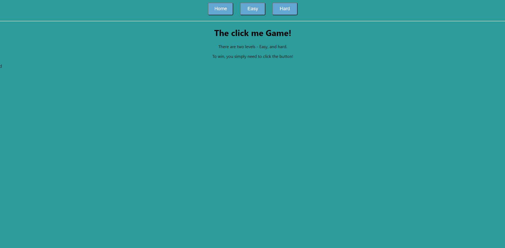
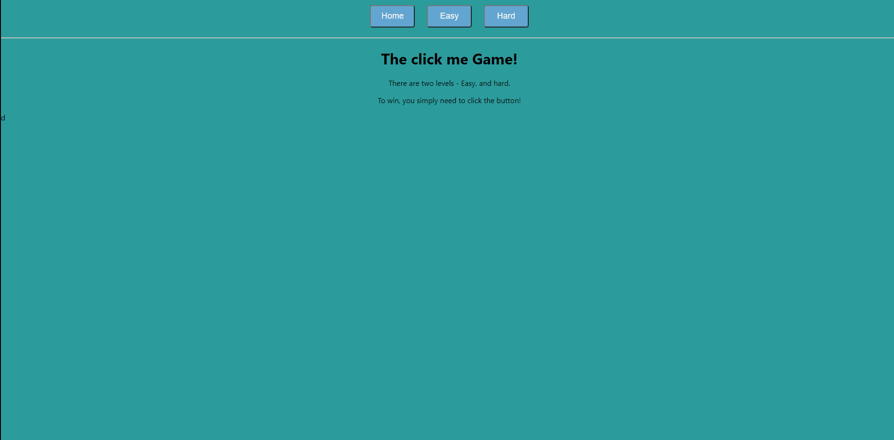

#Aminamax

### A starter for a project to figure out TypeScript

Here are some useful links to get started:

-   [What is tsconfig.json?](https://www.typescriptlang.org/docs/handbook/tsconfig-json.html)

-   [TypeScript](https://www.typescriptlang.org/docs/home.html)

-   [React](https://reactjs.org/docs/hello-world.html)


### The Game
Currently its simple -- click the box and perhaps you will see a personalized message! 

#### Modes
The game currently supports easy mode, however work is under way to support a hard mode as well.

#### Easy Mode


## Hard Mode



## Get Started

To get started, navigate to the folder with this README, and run:

```
npm install

npm start
```

If you ever hit any issues, feel free to delete the folder called 'node_modules' and then reinstall.

Make sure you commit anny changes to package.json to the repo!

Feel free to add any functionality to this project that you'd like! Its all fun and games!

Happy Hacking!
